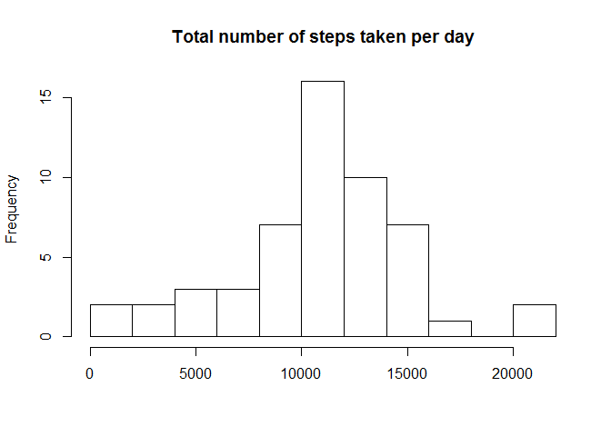
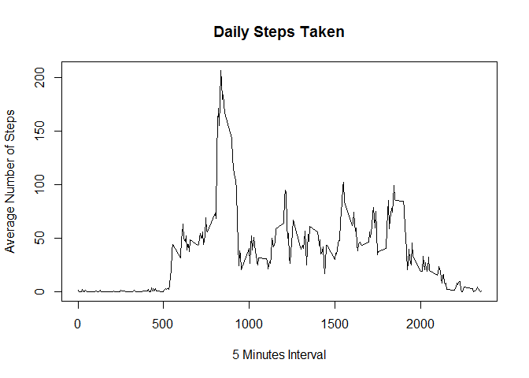
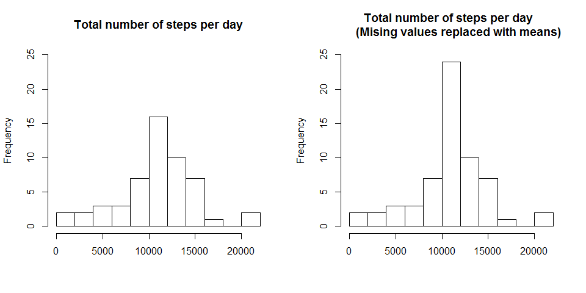
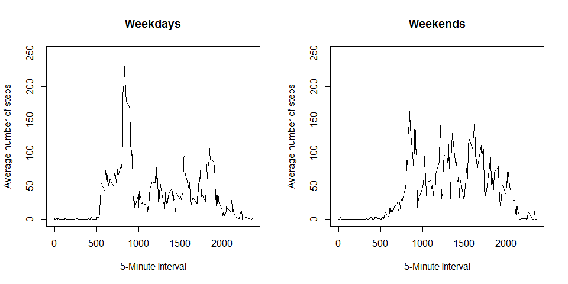

# Reproducible Research: Peer Assessment 1
###This report includes the analysis performed on data from a personal activity monitoring device.
###This device collects data at 5 minute intervals through out the day. The data consists of two months of data from an anonymous individual collected during the months of October and November, 2012 and include the number of steps taken in 5 minute intervals each day.
### The exploratory analysis shown in this report will analyze 3 main questions:
###**What is mean total number of steps taken per day?**
###**What is the average daily activity pattern?**
###**Are there differences in activity patterns between weekdays and weekends?**
###The variables included in this dataset are:
### **steps:** Number of steps taking in a 5-minute interval (missing values are coded as NA)
### **date:** The date on which the measurement was taken in YYYY-MM-DD format
### **interval:** Identifier for the 5-minute interval in which measurement was taken
###The dataset is stored in a comma-separated-value (CSV) file and there are a total of 17,568 observations in this dataset.


## Loading and preprocessing the data
Check if the Zip file, with the Activities data exist, and if so, unzip it:

```r
if (!file.exists("activity.csv")) {
    unzip("activity.zip")
}
```
Read the content of the **activity.csv** file, and review the data included:

```r
activity <- read.csv("activity.csv", colClass=c('integer', 'Date', 'integer'))
str(activity)
```

```
## 'data.frame':	17568 obs. of  3 variables:
##  $ steps   : int  NA NA NA NA NA NA NA NA NA NA ...
##  $ date    : Date, format: "2012-10-01" "2012-10-01" ...
##  $ interval: int  0 5 10 15 20 25 30 35 40 45 ...
```
There are some missing values, but for the completing the first 3 tasks we can ignore them


## What is mean total number of steps taken per day?
1. Calculate the total number of steps taken per day:

```r
stepsperday <- tapply(activity$steps, activity$date, sum)
```
2. Make a histogram of the total number of steps taken each day:

```r
hist(stepsperday,10, main = "Total number of steps taken per day", xlab = "")
```



3. Calculate the mean and median of the total number of steps taken per day (ignoring missing values):

```r
mean(stepsperday, na.rm = TRUE)
```

```
## [1] 10766.19
```

```r
median(stepsperday, na.rm = TRUE)
```

```
## [1] 10765
```


## What is the average daily activity pattern?
In order to calculate and present average values we will:  
* Create a 'clean' data set without the missing values  
* Calculate the average number of steps taken at each interval (of 5 minutes) accross all days  
* Make a time series plot of the average average number of steps taken at each interval  

```r
cln_activity <- activity[which(!is.na(activity$steps)),]
dailyactivity <- tapply(cln_activity$steps, cln_activity$interval,mean)
plot(y = dailyactivity, x = names(dailyactivity), type = "l", xlab = "5 Minutes Interval", 
     main = "Daily Steps Taken", ylab = "Average Number of Steps")
```



**Which 5-minute interval, on average, across all the days in the dataset, contains the maximum number of steps?**

```r
dailyactivity[dailyactivity==max(dailyactivity)]
```

```
##      835 
## 206.1698
```

## Imputing missing values

Calculate the total number of missing values in the dataset (i.e. the total number of rows with NAs):

```r
sum(is.na(activity$steps))
```
missing values 2304.

Create a new data set as the original and use *tapply* for filling in the missing values 
with the average number of steps per 5-minute interval:

```r
new_activity <- activity
nas <- is.na(new_activity$steps)
avg_interval <- tapply(new_activity$steps, new_activity$interval, mean, na.rm=TRUE, simplify=TRUE)
new_activity$steps[nas] <- avg_interval[as.character(new_activity$interval[nas])]
```
Check that there are no missing values left:

```r
sum(is.na(new_activity$steps))
```
missing values 0.


calculate the total number of steps taken per day and make a histogram of the total number of steps taken each day with imputed data and compare to original data:

```r
new_stepsperday <- tapply(new_activity$steps, new_activity$date, sum)

par(mfrow=c(1,2))
hist(stepsperday,10, main = "Total number of steps per day", xlab = "", ylim =c(0, 25))

hist(new_stepsperday,10, main = "Total number of steps per day  
     (Mising values replaced with means)", xlab = "", ylim =c(0, 25))
```


 
Calculate the mean and median of the total number of steps taken per day with imputed data:

```r
mean(new_stepsperday)
```

```
## [1] 10766.19
```

```r
median(new_stepsperday)
```

```
## [1] 10766.19
```

## Are there differences in activity patterns between weekdays and weekends?

Use the imputed data set to create factor variable in the dataset with two levels:
"weekday" and "weekend" indicating whether a given date is a weekday or weekend day

```r
new_activity$wd <- weekdays(new_activity$date)
new_activity$daytype<- as.factor(c("weekend", "weekday"))
new_activity[new_activity$wd == "Sunday" | new_activity$wd == "Saturday" ,5] <- factor("weekend")
new_activity[!(new_activity$wd == "Sunday" | new_activity$wd == "Saturday"),5] <- factor("weekday")
```
Subset the data set into 2 seperate data set for "weekdays" and "weekends":

```r
new_activity_we <- subset(new_activity, daytype == "weekend") 
new_activity_wd <- subset(new_activity, daytype == "weekday")
```
Calculate the average number of steps taken at each interval (of 5 minutes) accross all days:

```r
dailyactivity_we <- tapply(new_activity_we$steps, new_activity_we$interval, mean)
dailyactivity_wd <- tapply(new_activity_wd$steps, new_activity_wd$interval, mean)
```
Make panel plot containing a time series plot of the average average number of steps taken at each interval:

```r
par(mfrow=c(1,2))
plot(y = dailyactivity_wd, x = names(dailyactivity_wd), type = "l", xlab = "5-Minute Interval", 
     main = "Weekdays", ylab = "Average number of steps", ylim =c(0, 250))
plot(y = dailyactivity_we, x = names(dailyactivity_we), type = "l", xlab = "5-Minute Interval", 
     main = "Weekends", ylab = "Average number of steps", ylim =c(0, 250))
```




